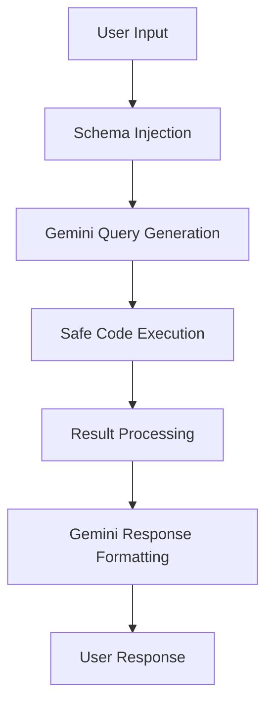

# Financial Data Chatbot

A Streamlit-based chatbot that allows users to query financial data using natural language. The chatbot leverages Google Gemini Flash 2.5 Lite to generate pandas code from user queries and then executes that code to retrieve and analyze financial data.

## Features

- **Natural Language Queries**: Ask financial questions in plain English
- **Data Visualization**: Automatic chart generation for numerical data
- **Code Transparency**: View the generated pandas code for each query
- **Export Functionality**: Download chat history for future reference
- **Example Queries**: Get started quickly with sample questions
- **Data Overview**: Sidebar with information about available companies, countries, and accounts

## Architecture



### Core Workflow

1. **User Input**: "What is the revenue growth of Q2 vs LY for Falabella retail Chile?"
2. **Schema Injection**: Load relevant schema docs into prompt
3. **Query Generation**: Gemini generates pandas code
4. **Code Execution**: Execute generated code safely
5. **Result Processing**: Send raw results back to Gemini
6. **Response Generation**: Gemini creates natural language response

## Project Structure

```
financial-chatbot/
├── app.py                          # Main Streamlit app
├── requirements.txt                # Dependencies
├── .env.example                    # Template for API key
├── .gitignore                      # Exclude .env
├── README.md                       # Project documentation
├── data/                           # Excel files
│   └── P&L_ChatBot.xlsx            # Financial data
├── schema/                         # Schema documentation
│   └── P&L.md                      # Profit & Loss schema
└── utils/
    ├── data_loader.py              # Excel loading logic
    ├── query_generator.py          # LLM query generation
    └── response_formatter.py       # Response formatting
```

## 🛠️ Setup Instructions

### Prerequisites

- Python 3.8 or higher
- Google Gemini API key

### Installation

1. Clone the repository:
   ```bash
   git clone https://github.com/felipemedlev/Financial-Data-AI-Chatbot
   cd Financial-Data-AI-Chatbot
   ```

2. Install dependencies:
   ```bash
   pip install -r requirements.txt
   ```

3. Set up environment variables:
   ```bash
   cp .env.example .env
   ```
   Then edit `.env` and add your Google API key:
   ```
   GOOGLE_API_KEY=your_actual_api_key_here
   ```

### Running the Application

```bash
streamlit run app.py
```

The app will open in your default browser at `http://localhost:8501`.

## Key Implementation Details

### Data Loading Strategy

- Load all Excel files at startup with `@st.cache_data`
- Create a unified DataFrame with month/quarter columns
- Index by company, business unit, geography for fast filtering

### Query Generation Prompt Template

```
You are a financial data analyst. Given this schema and user question, generate pandas code.

SCHEMA:
{schema_docs}

AVAILABLE DATA:
- Companies: {company_list}
- Date Range: {date_range}
- Business Units: {business_units}

USER QUESTION: {user_question}

Generate only valid pandas code that answers the question. Return code between ```python and ```.
```

### Safe Code Execution

- Use `ast` module to validate generated code
- Whitelist allowed operations (no file I/O, imports, etc.)
- Catch and handle execution errors gracefully

## Streamlit App Features

### Main Interface

- Chat-like interface with message history
- Show generated pandas code (collapsible)
- Display results as tables and charts
- Export functionality for results

### Sidebar

- Data overview (available companies, date ranges)
- Schema browser
- Query examples
- Settings (temperature, model parameters)

## Gemini Integration

### Setup

```python
from google import genai
client = genai.Client(api_key=api_key)
response = client.model.generate_content(
            model='gemini-2.5-flash-lite-06-17',
            contents=prompt,
            generation_config={'temperature': temperature}
        )
```

### Two-Stage Process

1. **Query Generation**: Generate pandas code
2. **Response Formatting**: Convert results to natural language

## Deployment Strategy

### Streamlit Community Cloud

1. Push to GitHub (with `.env` in `.gitignore`)
2. Go to [share.streamlit.io](https://share.streamlit.io)
3. Connect repository
4. Add secrets in dashboard
5. Deploy

## Sample Queries

- "What is the total revenue for Falabella Retail in 2023?"
- "Compare expenses between Chile and Peru for Sodimac"
- "Show me the profit trend for Tottus over the last 3 years"
- "What is the revenue growth of Q2 vs LY for Falabella retail Chile?"
- "Show me the operating margin for all companies in USD"

## Security Considerations

- API keys are stored in environment variables
- Generated code is validated using the `ast` module
- Only safe pandas operations are allowed
- No file I/O or system commands are permitted